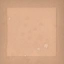
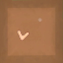
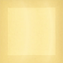
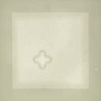
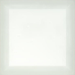
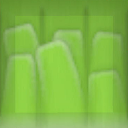
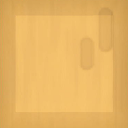

# NSO Playtest Program Pieces Guide

A non-exhaustive guide to the pieces that make up Planetary Blocks and Moons in the NSO Playtest Program.

##  Ground

The solid ground of the Planet and Moons. It can take different appearances depending on the circumstances.

### Obtaining

Ground covers the totality of Planetary Blocks and Moons. It can be created when:
- A Leveler Stone is broken
- [&nbsp;Concrete](#--concrete) reacts with [&nbsp;Water](#--water)

### Breaking

Ground can only be broken using a Hammer. Upon breaking, it yields nothing.

##   Soil

A pale brown piece used to grow Seeds into Sprouts. Stoneworker and <dfn title="Fantasy Crafter, Fashion Designer, Confectioner, Sushi Chef, Cake Maker, Dev-Core Crafter">Artisan</dfn> outfits can be used to apply a pattern on this piece.

### Obtaining

Deposits of Soil generate abudantly on Planetary Blocks. It can also be found on certain Moons. Soil is obtained when:
- [&nbsp;Magma](#--magma) reacts to &nbsp;Frost
- [&nbsp;Magma](#--magma) reacts to [&nbsp;Ice](#--ice)
- [&nbsp;Magma](#--magma) reacts to [&nbsp;Water](#--water)
- [&nbsp;Sand](#--sand) reacts to [&nbsp;Water](#--water)

### Breaking

Soil has low hardness. Upon breaking, it yields nothing.

##   Field Soil

A dark brown piece specked with grass used to grow Seeds into Sprouts. Stoneworker and <dfn title="Fantasy Crafter, Fashion Designer, Confectioner, Sushi Chef, Cake Maker, Dev-Core Crafter">Artisan</dfn> outfits can be used to apply a pattern on this piece.

Seeds placed on Field Soil grow faster than on [&nbsp;Soil](#--soil).

### Obtaining

Field Soil generates naturally within deposits of [&nbsp;Soil](#--soil). Field Soil is obtained when:
- A Garden Hoe is used on [&nbsp;Soil](#--soil).

### Breaking

Field Soil has low hardness. Upon breaking, it yields nothing.

##   Sand

A fragile pale yellow piece that turns to Glass Spike when exposed to Magma. Stoneworker and <dfn title="Fantasy Crafter, Fashion Designer, Confectioner, Sushi Chef, Cake Maker, Dev-Core Crafter">Artisan</dfn> outfits can be used to apply a pattern on this piece.

### Obtaining

Deposits of Sand generate abundantly on Planetary Blocks. It can also be found on certain Moons. Sand is obtained when:
- [&nbsp;Soil](#--soil) reacts to Swamp
- [&nbsp;Field Soil](#--field-soil) reacts to Swamp
- Grass reacts to Swamp
- Glass Spike reacts to Swamp
- Glass reacts to Swamp

### Breaking

Sand has very low hardness and breaks instantly, breaking adjacent Sand pieces with it. Upon breaking, it yields nothing.

##   Clay

A tan piece with a cross motif that turns to Ceramic when exposed to Magma. Stoneworker and <dfn title="Fantasy Crafter, Fashion Designer, Confectioner, Sushi Chef, Cake Maker, Dev-Core Crafter">Artisan</dfn> outfits can be used to apply a pattern on this piece.

### Obtaining

Clay can be found on certain Moons. Clay is obtained when:
- Any type of Rock reacts to Swamp

### Breaking

Clay has low hardness. Upon breaking, it yields nothing.

##   Ceramic

A glossy white piece obtained from Clay. Stoneworker and <dfn title="Fantasy Crafter, Fashion Designer, Confectioner, Sushi Chef, Cake Maker, Dev-Core Crafter">Artisan</dfn> outfits can be used to apply a pattern on this piece.

### Obtaining

Ceramic can be found on certain Moons. Ceramic is obtained when:
- Clay reacts to Magma

### Breaking

Ceramic has low hardness. Upon breaking, it yields nothing.

##   Grass

A green clump of grass that breaks when a piece is placed on top of it. <dfn title="Fantasy Crafter, Fashion Designer, Confectioner, Sushi Chef, Cake Maker, Dev-Core Crafter">Artisan</dfn> outfits can be used to apply a pattern on this piece.

### Obtaining

Grass can be found on Planetary Blocks and certain Moons. Grass is obtained when:
- Water reaches its spreading limit.

### Breaking

Grass has low hardness. Upon breaking, it yields nothing.

##   Tree Trunk

A brown section of log found in trees. Woodworker and <dfn title="Fantasy Crafter, Fashion Designer, Confectioner, Sushi Chef, Cake Maker, Dev-Core Crafter">Artisan</dfn> outfits can be used to apply a pattern on this piece.

### Obtaining

Tree Trunk is created when a tree grows. Trees grow when:
- Darkness is vainquished in a Planetary Block.
- A Sprout is grown.
- A Tree Knot is struck.

### Breaking

Tree Trunk has low hardness. Upon breaking, it yields a Wood card.